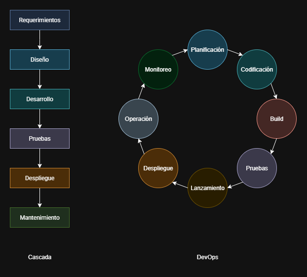
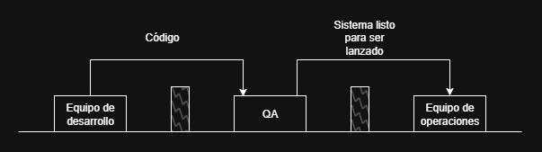

# Actividad 1: Introduccion DevOps, DevSecOps

## DevOps vs Cascada tradicional

### 1. Diagrama comparativa

  

#### **Cascada tradicional**

El modelo tradicional de cascada tiene un enfoque lineal y secuencial para el desarrollo de software, donde cada fase debe completarse antes de comenzar la otra fase. Las caracteristicas principales de este modelo es:

- Es rigido a los cambios una vez una fase se haya completado.
- Los usuarios finales no ven el software hasta las ultimas etapas.
- Los errores o malentendidos en fases iniciales pueden ser muy costosos.
- Cada fase ponen una gran enfasis en la documentacion.

#### **DevOps**

DevOps es una cultura, un conjunto de practicas y herramientas que integra a los equipos de desarrollo, equipos de calidad y equipos de operaciones para automatizar y agilizar procesos en todas las areas. Su objetivo principal es acortar el ciclo de vida del desarrollo y proporcionar software de alta calidad. Sus caracteristicas principales:

- Colaboracion continua y la eliminacion de silos organizacionales entre equipos.
- Automatizacion de pruebas, despliegues y monitoreo.
- Feedback continuo de forma rapida
- Monitoreo del rendimiento y salud de las aplicaciones en produccion.

### 2. Por qué DevOps acelera y reduce el riesgo en software para la nube frente a la cascada

Muchas caracteristicas de DevOps hacen que sea mas seguro y ventajoso para el desarrollo de software, como:

- Es facil desplegar rapidamente nuevas funcionalidades a un conjuntos de usuarios o a entornos de prueba, lo que nos permite obtener feedback de inmediato, evitandonos errores o problemas de diseño en la funcionalidad que implementamos, asi dandonos tiempo de corregir cuando el coste de cambio es aun menor.
- Se promueve la entrega continua de nuevas funcionalidades en pequeños lotes, estos cambios generalmente son pequeños y aislados, asi reduciendo  complejidad y riesgos en los despliegues ademas de ofrecer al usuario nuevas caracteristicas o correcciones en tiempo record.
- La automatizacion de la integracion continua (CI) y despliegue continuo (CD) aseguran los pasos de pruebas y despliegue se realicen sin errores, asi evitando cuellos de botella manuales, errores humanos y reduciendo el tiempo.

### 3. Contexto real donde un enfoque cercano a cascada sigue siendo razonable

Si bien DevOps es ampliamente adoptado, existen contextos donde un enfoque más cercano al modelo de cascada puede ser razonable o incluso preferible, especialmente cuando la razón principal es la seguridad y la fiabilidad por encima de la velocidad de desarrollo. Un ejemplo podria ser un software para plantas nucleares.

1. **Requisito de Seguridad y Certificacion Extrema**
   1. **Criterio Verificable** El software diseñado debe cumplir con regulaciones internacionales extramadamente estrictas y pasar un proceso de certificacion riguroso, cada linea de codigo debe ser revisada, probada y documentada formalmente.
   2. **Trade-off**: El proceso es muy blento y burocratico, asi que la velocidad de DevOps, con sus iteraciones y despligues frecuentes, seria riesgoso mas que todo por el tiempo y que un error podria provocar consecuencias graves. El modelo de cascada, con sus fases estrictas nos permite que cada fase sea validado, priorizando la seguridad por encima de otro factor.
2. **Acoplamiento inmutable con Hardware Critico**
   1. **Criterio Verificable** El software diseñado debe trabajar con un hardware de alto costo, que no se puede actualizar o reemplazar facilmente
   2. **Trade-off**:  La fiabilidad y la estabilidad a lo largo de la vida útil del sistema son el objetivo principal. El modelo de cascada invierte un tiempo significativo en la fase de diseño inicial para garantizar que el software sea compatible y robusto con este hardware desde el principio. Un enfoque de DevOps podría introducir incompatibilidades impredecibles o bugs en el sistema que serían casi imposibles.
   
## Ciclo tradicional de dos pasos  y silos

### 1. Diagrama de silos organizacionales

  

Este diagrama ilustra cómo los equipos pueden operar de forma aislada, lo que lleva a costos de integración tardía y una acumulación de defectos en espera debido a la falta de comunicación y colaboración fluida.

### 2. Limitaciones del Ciclo "Construcción -> Operación" sin Integración Continua

1. **Grande Lotes y Handoff ineficientes:** Sin que haya una integracion continua, el equipo de desarrolladores pueden estar acumulando una gran cantidad de cambios y cuando este equipo considera terminado, se produce un *handoff*, es decir una transferencia, al equipo de pruebas, pero este equipo no tiene conocimiento del trabajo que avanzo el equipo de desarrollo. No conoce las configuracion, entorno, no estan familiarizados con el producto hecho en el equipo de desarrollo, lo que podria ocacionar demoras, fricciones, asimetrias de información (cuando el equipo de desarrollo conoce detalles cruciales que el otro equipó desconoce).
2. **Colas de defectos y Feedback tardio:** Sin tener una integracion continua del softeware, los desarrolladores no tienen una retroalimentacion sobre la calidad de su codigo, la integracion con otros componentes o su rendimiento en un entorno de produccion hasta mucho despues tiempo, ocasionando una cola de defectos donde los bugs se acumulan en espera de ser resueltos, aumentandoi el retrabajo, donde puede degradar la calidad del software.

### 3. Pregunta Retadora: Anti-patrones y cómo agravan incidentes

1. **Throw Over the Wall**: Este anti-patrón describe la situación en la que el equipo de desarrollo "lanza" el código terminado a otro equipo sin una comunicación y asumiendo que el otro equipo se encargará de cualquier problema. Es una versión extrema del handoff ineficiente. Las asimetrías de información son abundantes, ya que el conocimiento crucial sobre el funcionamiento interno del software y las decisiones de diseño se queda en el equipo de desarrollo.
   1. **Como se agrava el incidente**: Cuando ocurre un incidente en producción, el equipo de operaciones no puede diagnosticar rápidamente el problema. Deben recurrir al equipo de desarrollo, que puede estar ocupado con otras tareas. Este desconocimiento aumenta el tiempo medio de recuperacion del accidente (MTTR), afectando la disponibilidad del servicio.
   
2. **Seguridad como Auditoria Tardia**: Este anti-patrón se presenta cuando la seguridad se considera una fase separada que ocurre al final del desarrollo, a menudo justo antes del despliegue o después de que el software ya está en producción. En lugar de integrar prácticas de seguridad desde el principio, se trata como una *auditoría tardía* o un *chequeo de última hora*, a menudo encontrando vulnerabilidades después de que el código ha sido desplegado.
   1. **Como se agrava el incidente**: Descubrir vulnerabilidades críticas al final significa que corregirlas es mucho más costoso y requiere retrabajos significativos. Si las vulnerabilidades no se corrigen a tiempo, aumenta la probabilidad de incidentes de seguridad (filtraciones de datos, ataques).

## Principios y Beneficios de DevOps

Los pilares de este enfoque DevOps son la Integración Continua (CI), el Despliegue Continuo (CD), la automatización y la colaboración.

### 1. Integracion Continua (CI) y Despligue Continuo (CD)

1. **Integracion Continua (CI)**:  Es la práctica de fusionar los cambios pequeños de código (commits) de los desarrolladores en una rama principal de forma regular y frecuente, reduciendo comlejidad y riesgo a comlictos. Cada vez que se fusiona el código, se ejecuta un conjunto de pruebas automatizadas para detectar errores, proporcionandonos feedback instantaneo, sobre si su codigo rompio algo o no. 

2. **Despligue Continuo (CD)**: Una vez que el código pasa las pruebas automatizadas y está listo, se prepara para su despliegue a un entorno de producción de forma automática. El CD permite que las funcionalidades que han superado las pruebas se desplieguen en entornos de prueba o de producción de forma segura y consistente.

CI y CD obligan a los equipos a colaborar. Los desarrolladores dependen de la infraestructura de operaciones para ejecutar el pipeline de CI/CD, y los equipos de operaciones necesitan el apoyo de los desarrolladores para resolver problemas detectados en las pruebas automatizadas o en la producción.

### 2. Agile como Precursor y su Impacto en el Pipeline

Durante las reuniones, los equipos discuten el progreso, los bloqueos y los proximos pasos. Si un desarrollador menciona que una prueba automatizada falla o que un despliegue se bloquea, el equipo puede tomar una decisión inmediata:

- Si un grupo de funcionalidades superaron las pruebas, se decide que se promoveran a otro equipo o en caso se identifica un problema crítico, el equipo decide bloquear el pipeline de despliegue hasta que se resuelva el problema.

Las retrospectivas se centran en la mejora continua del proceso. Los equipos pueden analizar datos del pipeline de CI/CD: ¿Qué falló en el último sprint? ¿Por qué el despliegue de una funcionalidad tardó más de lo esperado? Las decisiones que surgen de estas discusiones, cómo agregar un nuevo tipo de prueba o cómo mejorar el pipeline.

### 3. Indicador Observable para Medir la Colaboración Dev-Ops

Un indicador observable y no financiero para medir la mejora en la colaboración entre los equipos de Desarrollo y Operaciones podria ser el tiempo promedio desde que un PR es aprobado y fusionado hasta que el despligue finalice con exito, ya que un tiempo muy largo indica un handoff ineficiente entre los equipos, en cambio un tiempo muy corto demuestra que los equipos están colaborando de manera más fluida, automatizando procesos y resolviendo cuellos de botella juntos. Para poder medir este indicador, podemos hacer uso de la API de GitHub para obtener fecha del PR y comparar con los registros del sistema de despliegue.

## Evolución a DevSecOps

DevSecOps es la extensión natural de DevOps, que integra la seguridad como una responsabilidad compartida y continua en todo el ciclo de vida del desarrollo de software. El objetivo es pasar de una seguridad como "auditoría tardía" a una mentalidad de "seguridad desde el inicio" (Shift Left Security).

### 1. Diferencia entre SAST y DAST

1. **SAST (Static Application Security Testing)**: esta herramienta analiza el código fuente sin ejecutarlo. Busca patrones de codigo que puedan ser vunerables como inyecciones SQL, desbordamientos de búfer o credenciales codificadas. Esta herramienta se ubica tempranamente en el pipeline CI/CD, se ejecuta justo despues de un commit o un PR, esto nos permite obtener un feedback inmediato, permitiendo corregir el error  del codigo.
   
2. **DAST (Dynamic Application Security Testing)**: esta herramienta analiza la aplicación en ejecución simulando ataques desde el exterior. Actúa como un hacker, probando la URL de la aplicacion, inyectando datos, buscando fallos o vulnerabilidades en su entorno. Esta herramienta se ubica más tarde en el pipeline, en entornos de pruebas o staging, ya que necesita que la aplicacion este desplegada, esto nos permite descubrir vulnerabilidades que SAST no puede ver, como errores en la configuracion con el servidor, problemas de autenticación, etc.

#### 2. Gate Mínimo de Seguridad en el Pipeline

Para asegurar que el software no avance con vulnerabilidades críticas, se define un "security gate" (puerta de seguridad) que debe pasarse antes de la promoción a un entorno superior

1. **Umbral 1: Hallazgos críticos**: al detectar un hallazgo critico o alto por herramientas SAST O DAST, bloqueara la promocion del codigo a instancias de staging o produccion, ya que representan un riesgo inmediato para el sistema.
   
2. **Umbral 2: Cobertura de pruebas**: el escaneo SAST del codigo debe tener una cobertura minima del 95%, si es menor el pipeline fallara, ya que si no pasa la umbral podria ocultar vulnerabilidades.

#### 3. Política de Excepción y Recertificación

En ocaciones, una vulnerabilidad critica no puede ser correegida de inmediato, asi que se necesita una politica de excepción clara. Se necesita identificar al responsable que introdujo el código o que depende de el, luego se debe diseñar un plan claro de mitigacion o plan de correción. Esta excepcion debe tener una fecha de caducidad, ya que obliga a los equipos abordar la vulnerabilidad y evita que se quede sin resolver, despues de esta fecham el pipeline bloqueara el nuevo código que se añada hasta que se corrija. El aprobador de la excepcion generalmente es el equipo de seguridad o el product manager.

