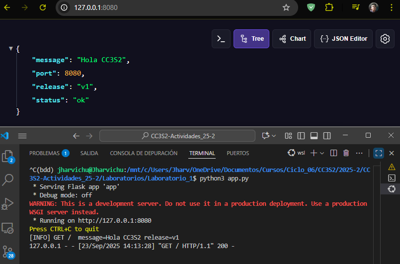
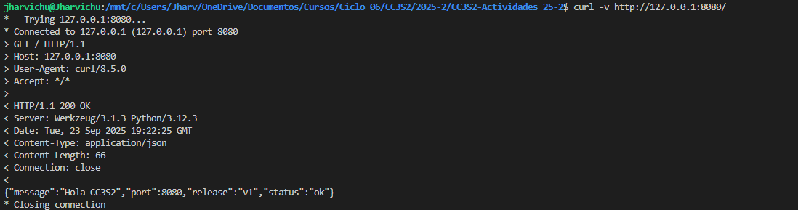
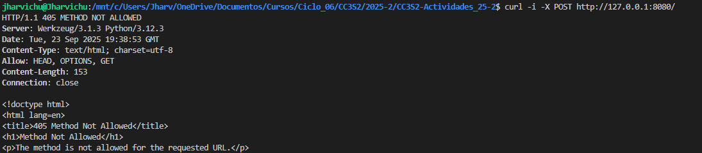
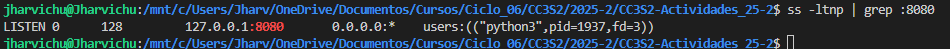
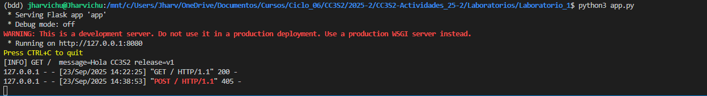

# Actividad 2: HTTP, DNS, TLS y 12-Factor (port binding, configuración, logs)

> Esta actividad se hace uso del laboratorio 1, para ver lo avanzado haga clic en [Laboratorio 1](../../Laboratorios/Laboratorio_1)

## 1. HTTP: Fundamentos y herramientas

### **Levantamiento de la APP**

**Levantamos la app** con variables de entorno **(12-Factor)**: `PORT=8080` `MESSAGE="Hola CC3S2"` `RELEASE="v1"` y con `python3 app.py`

<p align="center">
  
</p>

La aplicación web se ha desplegado y se encuentra escuchando en el puerto **8080**, tal como se muestra en la URL del navegador y la salida de la terminal. Además, la aplicación genera una salida estándar (*stdout*) :

```
[INFO] GET / message=Hola CC3S2 release=v1 127.0.0.1 - [23/Sep/2025 14:13:28] "GET / HTTP/1.1" 200 -
```

### **Inspección con curl:**

Colocamos este comando con la herramienta `curl` con el metodo **GET** a la *url* : `http://127.0.0.1:8080/`.

```
curl -v http://127.0.0.1:8080/
```

<p align="center">
  
</p>

La salida del comando curl muestra la comunicación completa de una solicitud web. Primero, se ven las cabeceras de la respuesta del servidor, que son metadatos clave como el tipo de contenido (`Content-Type: application/json`) y el software del servidor. Luego, se indica el código de estado, que en este caso es `200 OK`, lo que confirma que la solicitud se procesó correctamente. Finalmente, se muestra el cuerpo **JSON**, que es el contenido principal de la respuesta, un objeto con la información que la aplicación está diseñada para devolver.

Colocamos este comando con la herramienta curl con el metodo **POST** a la *url* : `http://127.0.0.1:8080/`

```
curl -i -X POST http://127.0.0.1:8080/
```

<p align="center">
  
</p>

En la imagen, al intentar usar el método `POST` en la ruta `/`, el servidor no lo reconoce como una acción válida y responde con un código `405 Method Not Allowed` ya que el script `app.py` solamente tiene el metodo `GET`

**¿Qué campos de respuesta cambian si actualizas MESSAGE/RELEASE sin reiniciar el proceso?**

El proceso de la aplicación, una vez iniciado, carga el código y sus variables en la memoria. Los valores de `MESSAGE` y `RELEASE` se establecen en el momento del arranque del servidor. Sin reiniciar el proceso, el servidor continúa usando la versión del código que tiene cargada en la memoria, ignorando los cambios que hayas hecho en el archivo. Para que los nuevos valores de las variables sean leídos y usados por la aplicación, es **obligatorio detener el proceso y volver a iniciarlo**.

### **Puntos abiertos con `ss`**

Ejecutamos este comando:

```
ss -ltnp | grep :8080
```

<p align="center">
  
</p>

Este comando demuestra que un proceso está escuchando en el puerto 8080. La salida `LISTEN` confirma que el socket está activo y en espera de conexiones, mientras que la información del usuario `(users:(("python3",pid=4957,fd=3)))` es la evidencia clave. Esta línea muestra que la aplicación con el **ID de proceso (PID) 4957** es la responsable de abrir y mantener el socket en el puerto **8080**, confirmando que la app se está ejecutándo y listo para recibir peticiones.

### **Logs como flujo**

<p align="center">
  
</p>

