# Actividad 5: Construyendo un pipeline DevOps con Make y Bash

## Parte 1: Construir - Makefile y Bash desde cero

1. Se creo el siguiente script de Python basico para hacer uso en el makefile:

    ``` python
    def saludo(name):
        return f"Hola, {name}!"

    if __name__ == "__main__":
        print(saludo("Jharvy"))
    ```

2. Ademas el siguiente Makefile basico con algunos targets implementados:

    ``` Makefile
    SHELL := bash
    .SHELLFLAGS := -eu -o pipefile -c
    MAKEFLAGS 	+= --warn-undefined-variables --no-builtin-rules
    .DELETE_ON_ERRORW:
    .DEFAULT_GOAL 	:= help
    export LC_ALL	:= C
    export LANG 	:= C
    export TZ		:= UTC

    .PHONY: all build test package clean help init tools check benchmark format dist-clean verify-repo

    PYTHON		?= python3
    SHELLCHECK	:= shellcheck
    SHFMT		:= shfmt
    SRC_DIR		:= src
    TEST_DIR	:= test
    OUT_DIR		:= out
    DIST_DIR	:= dist

    all: tools lint build test package ## Construir, testear y empaquetar todo

    build: $(OUT_DIR)/hello.txt ## Generar out/hello.txt

    $(OUT_DIR)/hello.txt: $(SRC_DIR)/hello.py
        mkdir -p $(@D)
        $(PYTHON) $< > $@

    clean: ## Limpiar archivos generados
        rm -rf $(OUT_DIR) $(DIST_DIR)

    help: ## Mostrar ayuda
        @grep -E '^[a-zA-Z0-9_-]+:.*?## ' $(MAKEFILE_LIST) | awk -F':|##' '{printf "  %-12s %s\n", $$1, $$3}'
    ```

### Ejercicios

**1. Ejecuta `make help` y guarda la salida para análisis. Luego inspecciona `.DEFAULT_GOAL` y `.PHONY` dentro del Makefile.**

Comandos utilizados:

``` bash
mkdir -p logs evidencia
make help | tee logs/make-help.txt
grep -E '^\.(DEFAULT_GOAL|PHONY):' -n Makefile | tee -a logs/make-help.txt
```

<p align="center">
  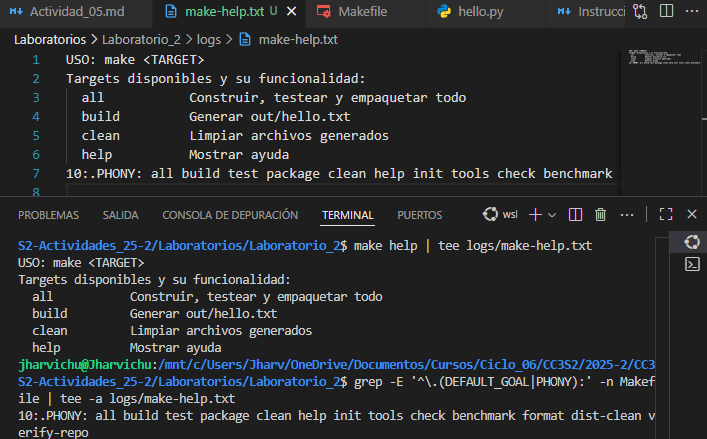
</p>

Al ejecutar make help, el comando muestra una lista formateada de todos los targets disponibles en el Makefile junto con sus descripciones. Esto facilita la comprensión de las acciones que se pueden realizar, como `build`, `test` o `clean`, sin necesidad de revisar el código del Makefile. La línea `.DEFAULT_GOAL := help` define que, al ejecutar make sin argumentos, se usará el target help como predeterminado. Ademas, la declaración `.PHONY` indica que ciertos targets, como `clean` o `build`, no corresponden a archivos reales, sino a acciones. Esto es esencial porque evita conflictos.

**2. Comprueba la generación e idempotencia de `build`. Limpia salidas previas, ejecuta `build`, verifica el contenido y repite `build` para constatar que no rehace nada si no cambió la fuente.**

Comandos utilizados:

``` bash
rm -rf out dist
make build | tee logs/build-run1.txt
cat out/hello.txt | tee evidencia/out-hello-run1.txt
make build | tee logs/build-run2.txt
stat -c '%y %n' out/hello.txt | tee -a logs/build-run2.txt
```

<p align="center">
  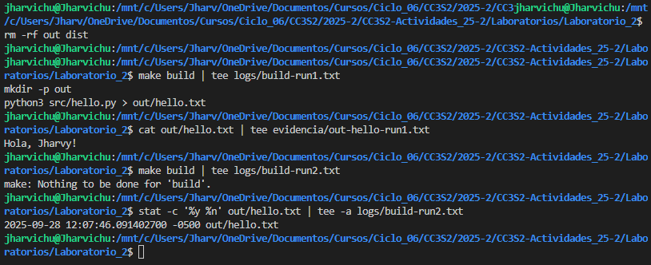
</p>

En la primera corrida `make build | tee logs/build-run1.txt`, make verifica si existe el archivo `out/hello.txt` (ya que lo necesita como requisito), por lo que ejecuta los comandos de ese target `$(OUT_DIR)/hello.txt`, que incluye crear el directiorio `out` y ejecutar el script de **Python** que produce `hello.txt`.

En la segunda corrida `make build | tee logs/build-run2.txt`, make verifica las marcas de tiempo de los archivos. Como `out/hello.txt` ya existe y no ha cambiado desde la ultima ejecucion, make no vuelve ejecutar el **target** `build`. Esto se debe a que el grafo de dependencias indica que el objetivo `out/hello.txt` está actualizado respecto a sus prerequisitos. El comando `stat` confirma esto al mostrar la fecha de modificación del archivo, que sigue siendo la misma que en la primera corrida.

**3. Fuerza un fallo controlado para observar el modo estricto del shell y `.DELETE_ON_ERROR`. Sobrescribe `PYTHON` con un intérprete inexistente y verifica que no quede artefacto corrupto.**

Comandos utilizados:

``` bash
rm -f out/hello.txt
PYTHON=python4 make build ; echo "exit=$?" | tee logs/fallo-python4.txt || echo "falló (esperado)"
ls -l out/hello.txt | tee -a logs/fallo-python4.txt || echo "no existe (correcto)"
```

<p align="center">
  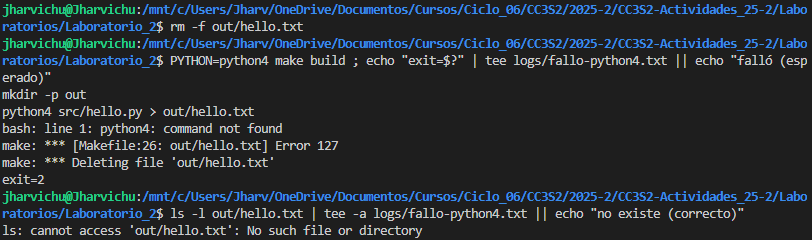
</p>

En este escenario, al cambiar el valor de **PYTHON** para `python4`, comando `mmake build` falla porque bash no puede ejecutar el comando. Asi que por las opciones `-eu -o piefail`, bash detiene la ejecucion despues del encontrar error `-e`, ya que trata a las variables no definidas como errores `-u` y hace que detenga la ejecucion `-o pipefail`. Ademas, con la opcion `.DELETE_ON_ERROR` en el Makefile garantiza que, si algun comando falla, el archivo generado por el comando se elimine automaticamente. Estos evita tener archivos corruptos o incompletos. Se puede verificar con el comando Filtra y localiza la línea específica en el log donde make analiza el target out/hello.txt.

**4. Realiza un "ensayo" (dry-run) y una depuración detallada para observar el razonamiento de Make al decidir si rehacer o no.**

Comandos utilizados:

``` bash
make -n build | tee logs/dry-run-build.txt
make -d build |& tee logs/make-d.txt
grep -n "Considering target file 'out/hello.txt'" logs/make-d.txt
```

<p align="center">
  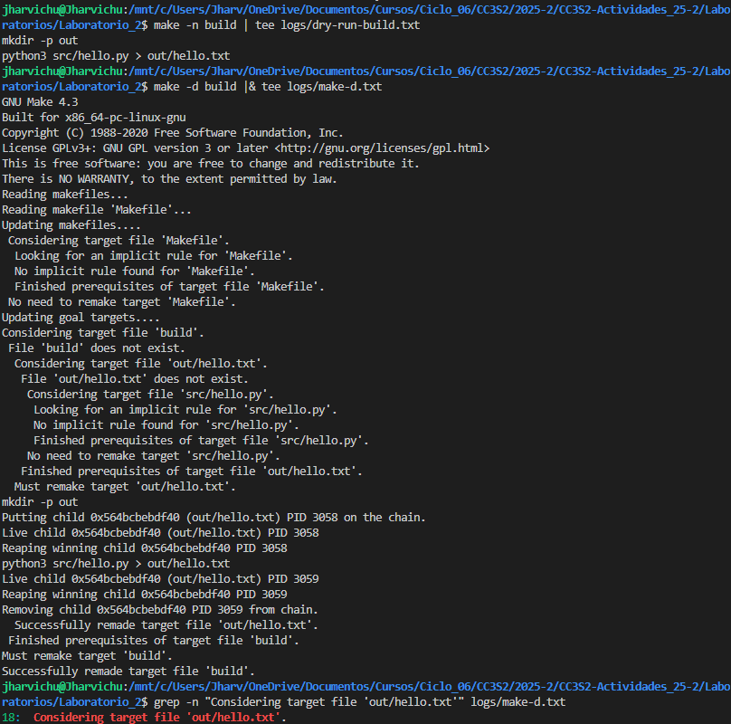
</p>

Los comandos ejecutados permiten analizar el comportamiento de make al construir el objetivo `build`:

- `make -n build | tee logs/dry-run-build.txt`: Muestra qué comandos ejecutaría `make` para construir `build` sin realmente hacerlo (**modo dry run**). El resultado en `logs/dry-run-build.txt` lista los pasos planeados, util para verificar logica del Makefile.
  
- `make -d build | tee logs/make-d.txt`: Genera un log detallado del proceso interno de `make`, incluyendo cómo evalúa dependencias, marcas de tiempo y decisiones de reconstrucción. El resultado lo escribe en `logs/make-d.txt`.
  
- `grep -n "Considering target file 'out/hello.txt'" logs/make-d.txt`: Filtra y localiza la línea específica en el log donde make analiza el target `out/hello.txt`.

**5. Demuestra la incrementalidad con marcas de tiempo. Primero toca la fuente y luego el target para comparar comportamientos.**

Comandos utilizados:

``` bash
touch src/hello.py
make build | tee logs/rebuild-after-touch-src.txt

touch out/hello.txt
make build | tee logs/no-rebuild-after-touch-out.txt
```

<p align="center">
  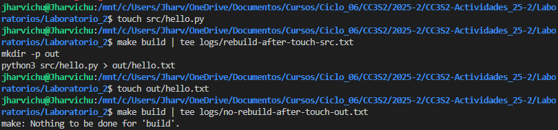
</p>

Make evalua las marcas de tiempo y las dependencias entre archivos, asi que al ejecutar el comando `touch src/hello.py` y `make build`, modifica la fecha (*su timestamp*) y make detecta este prerequisito como mmas reciente que el target `out/hello.txt`, por lo cual lo ejecutaria.

Al actualizar la fecha de `out/hello.txt`, make verifica que todos los archivos de los que depende (`src/hello.py`) son mas antiguos que el target. Como no hay cambios en las fuentes, make no realiza ninguna acción, evitando trabajo innecesario.

**6. Ejecuta verificación de estilo/formato manual (sin objetivos `lint/tools`). Si las herramientas están instaladas, muestra sus diagnósticos; si no, deja evidencia de su ausencia.**

Comandos utilizados:

``` bash
command -v shellcheck >/dev/null && shellcheck scripts/run_tests.sh | tee logs/lint-shellcheck.txt || echo "shellcheck no instalado" | tee logs/lint-shellcheck.txt
command -v shfmt >/dev/null && shfmt -d scripts/run_tests.sh | tee logs/format-shfmt.txt || echo "shfmt no instalado" | tee logs/format-shfmt.txt
```

<p align="center">
  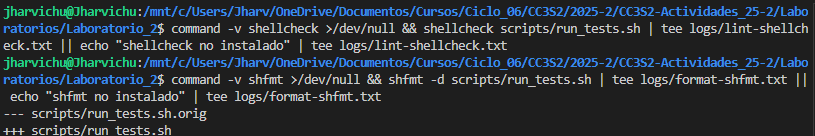
</p>

En ambos comandos, primero verifica si las herramientas estan instaladas, en caso esten lo utilizan en `scripts/run_tests.sh` y el resultado lo escribe `logs/`, en caso contrario, solamente se escribiria en `logs/` el mensaje *herramienta no instalada*. 
- `shellcheck`: Analiza el script en busca de errores sintácticos, malas prácticas o posibles bugs
- `shfmt`: Revisa el formato del script (sangrías, alineación, estilo) y sugiere mejoras.

**7. Construye un paquete reproducible de forma manual, fijando metadatos para que el hash no cambie entre corridas idénticas. Repite el empaquetado y compara hashes.**

Comandos utilizados:

``` bash
mkdir -p dist
tar --sort=name --mtime='@0' --owner=0 --group=0 --numeric-owner -cf dist/app.tar src/hello.py
gzip -n -9 -c dist/app.tar > dist/app.tar.gz
sha256sum dist/app.tar.gz | tee logs/sha256-1.txt

rm -f dist/app.tar.gz
tar --sort=name --mtime='@0' --owner=0 --group=0 --numeric-owner -cf dist/app.tar src/hello.py
gzip -n -9 -c dist/app.tar > dist/app.tar.gz
sha256sum dist/app.tar.gz | tee logs/sha256-2.txt

diff -u logs/sha256-1.txt logs/sha256-2.txt | tee logs/sha256-diff.txt || true
```

<p align="center">
  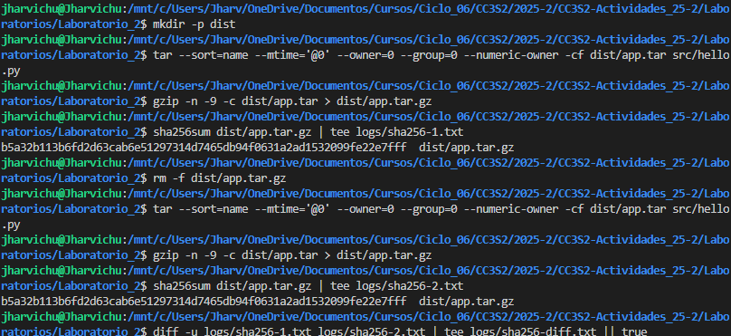
</p>

SHA-256 1: b5a32b113b6fd2d63cab6e51297314d7465db94f0631a2ad1532099fe22e7fff
SHA-256 2: b5a32b113b6fd2d63cab6e51297314d7465db94f0631a2ad1532099fe22e7fff

- `--sort=name`: Ordena los archivos en el `.tar` alfabéticamente por nombre, evitando que el orden de los archivos afecte el contenido del archivo `.tar`. Esto garantiza que el .tar sea idéntico en cada ejecución.
- `--mtime='@0'`: Establece la fecha de modificación de todos los archivos en el .tar al 1 de enero de 1970 (epoch 0), eliminando diferencias en las marcas de tiempo.
- `--numeric-owner --owner=0 --group=0`: Fija el propietario y grupo de los archivos en el `.tar` al usuario `root` (UID/GID = 0), evitando que los permisos y propietarios del sistema afecten el contenido del paquete. Esto asegura que el `.tar` sea portable entre diferentes sistemas.
- `gzip -n`: Omite el almacenamiento del nombre original del archivo en el `.gz`, evitando que metadatos variables se incluyan en el archivo comprimido. Esto garantiza que el `.tar`.gz sea reproducible incluso en entornos distintos.

**8. Reproduce el error clásico "missing separator" sin tocar el Makefile original. Crea una copia, cambia el TAB inicial de una receta por espacios, y confirma el error.**

Comandos utilizados:

``` bash
cp Makefile Makefile_bad
make -f Makefile_bad build |& tee evidencia/missing-separator.txt || echo "error reproducido (correcto)"   
```

Se modifica el `Makefile_bad`:

``` Makefile
...

build: $(OUT_DIR)/hello.txt ## Generar out/hello.txt

$(OUT_DIR)/hello.txt: $(SRC_DIR)/hello.py
 mkdir -p $(@D)
 $(PYTHON) $< > $@

clean: ## Limpiar archivos generados
	rm -rf $(OUT_DIR) $(DIST_DIR)

...
```

<p align="center">
  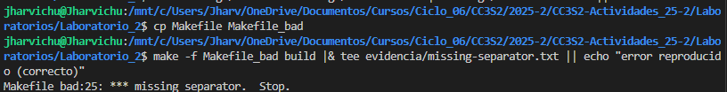
</p>

`make` exige un carácter de TAB (no espacios) al inicio de las líneas de receta porque es una regla histórica de diseño del lenguaje de los Makefiles. Este requisito permite distinguir claramente entre:

- Líneas de definición (ej: `target: prereq` o variables).
- Líneas de receta (comandos a ejecutar), que deben empezar con TAB.

Cuando se usan espacios en lugar de TAB, `make` muestra el error: `Missing separator. Stop`.

3. Ahora implementamos el script de `scrips/run_tests.sh` con el siguiente contenido:

    ``` Bash
    #!/usr/bin/env bash

    set -euo pipefail
    IFS=$'\n\t'
    umask 027
    set -o noclobber

    # Usa PYTHON del entorno si existe; si no, python3
    PY="${PYTHON:-python3}"

    # Directorio de código fuente
    SRC_DIR="src"

    # Archivo temporal
    tmp="$(mktemp)"

    # Limpieza segura + posible rollback de hello.py si existiera un .bak
    cleanup() {
        rc="$1"
        rm -f "$tmp"
        if [ -f "${SRC_DIR}/hello.py.bak" ]; then
            mv -- "${SRC_DIR}/hello.py.bak" "${SRC_DIR}/hello.py"
        fi
        exit "$rc"
    }
    trap 'cleanup $?' EXIT INT TERM

    # Verificación de dependencias
    check_deps() {
        local -a deps=("$PY" grep)
        for dep in "${deps[@]}"; do
            if ! command -v "$dep" >/dev/null 2>&1; then
                echo "Error: $dep no está instalado" >&2
                exit 1
            fi
        done
    }

    # Ejecuta un "test" simple sobre src/hello.py
    run_tests() {
        local script="$1"
        local output
        output="$("$PY" "$script")"
        if ! echo "$output" | grep -Fq "Hola, Jharvy!"; then
            echo "Test falló: salida inesperada" >&2
            mv -- "$script" "${script}.bak" || true
            exit 2
        fi
        echo "Test pasó: $output"
    }

    # Demostración de pipefail
    echo "Demostrando pipefail:"
    set +o pipefail
    if false | true; then
        echo "Sin pipefail: el pipe se considera exitoso (status 0)."
    fi
    set -o pipefail
    if false | true; then
        :
    else
        echo "Con pipefail: se detecta el fallo (status != 0)."
    fi

    # Escribir en $tmp (ya existe); '>|' evita el bloqueo de 'noclobber'
    cat <<'EOF' >|"$tmp"
    Testeando script Python
    EOF

    # Ejecutar
    check_deps
    run_tests "${SRC_DIR}/hello.py"
    ```

### Ejercicios

**1. Ejecuta ./scripts/run_tests.sh en un repositorio limpio. Observa las líneas "Demostrando pipefail": primero sin y luego con pipefail. Verifica que imprime "Test pasó" y termina exitosamente con código 0 (`echo $?`).**

<p align="center">
  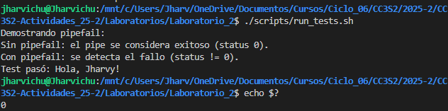
</p>

**2. Edita src/hello.py para que no imprima "Hello, World!". Ejecuta el script: verás "Test falló", moverá hello.py a hello.py.bak, y el trap lo restaurará. Confirma código 2 y ausencia de .bak.**

<p align="center">
  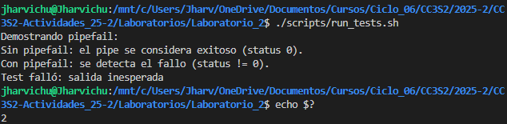
</p>

**3. Ejecuta `bash -x scripts/run_tests.sh`. Revisa el trace: expansión de `tmp` y `PY`, llamadas a funciones, here-doc y tuberías. Observa el trap armado al inicio y ejecutándose al final; estado 0.**

<p align="center">
  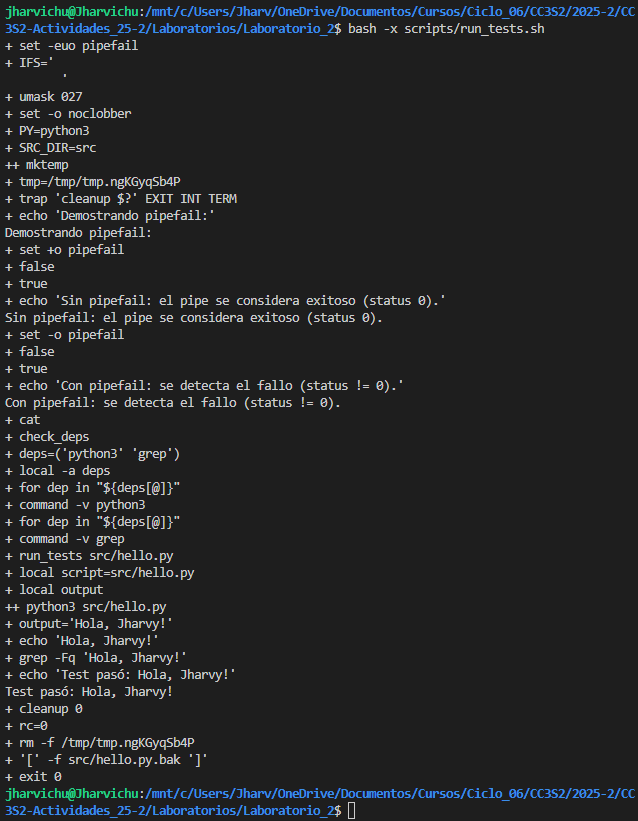
</p>

**4. Sustituye `output=$("$PY" "$script")` por `("$PY" "$script")`. Ejecuta script. `output` queda indefinida; con `set -u`, al referenciarla en `echo` aborta antes de `grep`. El trap limpia y devuelve código distinto no-cero**

```bash
... 
run_tests() {
	local script="$1"
	local output
	("$PY" "$script")  # Modificacion
	if ! echo "$output" | grep -Fq "Hola, Jharvy!"; then
		echo "Test falló: salida inesperada" >&2
		mv -- "$script" "${script}.bak" || true
		exit 2
	fi
	echo "Test pasó: $output"
}
...
```

<p align="center">
  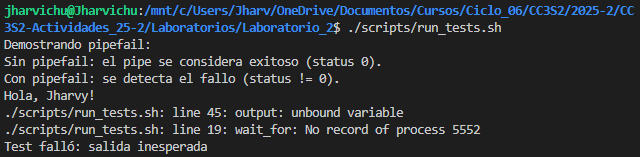
</p>


