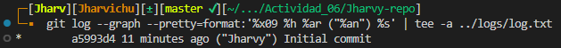

# **Actividad 6**: Introducción a Git conceptos básicos y operaciones esenciales

## Conceptos básicos de Git: Comienza con una experiencia práctica

### git config: Preséntate a Git

Ahora, hay algo que debes hacer antes de comenzar un proyecto. Preséntarnos a Git. Para presentarnos a Git, usamos el comando `git config`:

```bash
$ git config --global user.name "Jharvy"
$ git config --global user.email "jharvy.cadillo.t@uni.pe"
```

`git config` es un comando utilizado para configurar Git a nivel de sistema, usuario y repositorio. El nivel *system* se aplica a todos los usuarios y a todos los repositorios. El nivel *global* se aplica a todos los repositorios de un usuario específico. El nivel *local* se aplica solo a un repositorio.

Para verificar que la presentación se ha registrado, podemos comprobarlo con el comando `git config --list` y guardarlo en `../logs/config.txt`:

```bash
git config --list >> ../logs/config.txt
```

### git init: Donde comienza tu viaje de código

El comando `git init` se usa para inicializar un nuevo repositorio de Git y comenzar a rastrear directorios existentes. Cuando ejecutamos el comando, configura un directorio `.git` lleno de todo lo necesario para el control de versiones. 

```bash
// Crea un directorio
mkdir Jharvy-repo
cd Jharvy-repo/

// Verificamos la version e inicializamos el repositorio
git --version >> ../logs/git-version.txt
git init >> ../logs/init-status.txt
```

Ahora que se ha creado el directorio `.git/`, los cambios en los archivos se guardan en el directorio `.git/`, pero Git no guarda automáticamente los archivos. En Git, *guardar* se completa ejecutando el comando `git add`, que selecciona conscientemente los archivos para guardar entre los que se han editado, agregado o eliminado, y el comando `git commit`, que registra esos cambios.

A continuación, agreguemos algo de código al repositorio.

### git add: Preparando tu código

El comando `git add` es tu puente entre hacer cambios en tu directorio de trabajo y prepararlos para ser almacenados permanentemente en tu repositorio de Git. 

Cuando haces cambios en tus archivos, Git reconoce que estos archivos han cambiado, pero estos cambios no están automáticamente listos para convertirse en parte del historial. Aquí es donde entra `git add`. 

Primero, creamos un nuevo archivo en tu directorio `Jharvy-repo`:

```bash
// Creamos un archivo README.md
echo " README" > README.md
```

El comando `git status` muestra el estado actual de tu repositorio, mostrando qué archivos tienen cambios que están siendo rastreados y cuáles no. Cuando veamos el mensaje "*Untracked files*", es la forma de Git de informarte que hay un archivo del que aún no se le ha dicho que esté pendiente. 

En nuestro ejemplo, el archivo `README.md` es nuevo para Git y no está registrado; por lo tanto, está etiquetado como no rastreado:

```bash
// Verificando cómo Git reconoce el nuevo archivo
git status | tee -a ../logs/init-status.txt
```

Los archivos recién agregados son parte del proyecto, pero no han sido rastreados por Git. Para moverlos del estado no rastreado a un estado rastreado, usamos el comando `git add`:

```bash
git add README.md >> ../logs/add-commit.txt
```

Ahora Git reconoce `README.md` como un nuevo archivo y ahora está rastreado. El estado objetivo para guardar mediante el comando `git add` se llama *staged* (preparado). También puedes escuchar el término *índice* (index) utilizado indistintamente con *staging*. Antes de que los archivos o cambios sean preparados, residen en un área a menudo referida como el *espacio de trabajo* (workspace). 

Esta es esencialmente el entorno donde estás haciendo cambios activamente en tus archivos. 

Algunos también pueden referirse a esta área como el *árbol de trabajo* (worktree).

### git commit: registra cambios

El comando `git commit` registra los cambios que has preparado con `git add` en el historial del repositorio. Esto te permite rastrear cambios a lo largo del tiempo.

```bash
git commit -m "Initial commit" >> ../logs/add-commit.txt
```

Aquí, la bandera `-m` es seguida por un mensaje corto y descriptivo que captura la esencia de los cambios que has hecho.

Ahora, usemos el comando `git status` nuevamente para ver si todos los cambios en el directorio de trabajo actual han sido guardados:

```bash
git status | tee -a ../logs/init-status.txt 
```

Si aparece el mensaje "*nothing to commit*", los cambios han sido incorporados.

### git log: Recorrer el árbol de commits

El comando `git log` muestra una lista de *commits* realizados es un repositorio en orden cronológico inverso, es decir, el *commit* más reciente se muestra primero.

Para probar esto, usa el siguiente comando:

```bash
git log >> ../logs/log.txt
```

Esto mostrará una lista de todos los *commits*, cada uno con lo siguiente:

- **Identificador SHA-1 único**: Actúa como una firma para el *commit* y puede emplearse en varios comandos de Git para referirse a ese *commit* específico.
- **Detalles del committer**: Muestra el nombre y el correo electrónico de la persona que realizó el *commit*.
- **Marca de tiempo (timestamp) del commit**: Muestra cuándo se realizó el *commit*.
- **Mensaje del commit**: Una nota breve e informativa que captura la esencia de las modificaciones en el *commit*.

Además del comando básico `git log`, hay numerosas opciones que te permiten adaptar la salida a tus necesidades:

- `git log -p`: Muestra la diferencia (es decir, el parche) introducida en cada *commit*.
- `git log --stat`: Proporciona algunas estadísticas abreviadas para cada *commit*.
- `git log --oneline`: Da una salida más compacta, mostrando cada *commit* como una sola línea.
- `git log --graph`: Visualiza la historia de *ramas* y *merges* en un diseño de gráfico ASCII.
- `git log --author="Kapumota"`: Filtra los *commits* para mostrar solo los realizados por una persona específica (en este caso, "Kapumota").

Por ejemplo, también puede mejorar la perspectiva de la siguiente manera:

```bash
$ git log --graph --pretty=format:'%x09 %h %ar ("%an") %s'
```

**Pregunta**: ¿Cual es la salida de este comando?

<p align="center">
  
</p>

**Pregunta**: Intentemos el comando `git log` en este ejercicio (puedes realizar otra cosa como colocar las cosas en español). Primero, actualiza el archivo `README.md` y crea un nuevo archivo `CONTRIBUTING.md`:

```bash
echo " CONTRIBUTING" > CONTRIBUTING.md
git commit -m "Configuracion de la documentacion de contribucion del repositorio"
```

Una vez hecho, agregamos un código de ejemplo en Python:

```bash
echo "print('Hello World')" > main.py
git add .
git commit –m "Agrega main.py"
```

Cuando se confirme en el *log* que está correctamente registrado, está hecho:

```bash
git log --oneline | tee ../logs/log-oneline.txt
```

En esencia, el comando `git log` es una herramienta vital para cualquier desarrollador. Nos ayuda a navegar fácilmente a través del historial de tu código, ya sea que estemos buscando un cambio específico o simplemente revisando el trabajo anterior.

## Trabajar con ramas: La piedra angular de la colaboración

### git branch: Entendiendo los conceptos básicos de Git branch

Cuando se inicia un repositorio de Git, automáticamente crea una *rama (branch)* predeterminada, generalmente llamada `main` (anteriormente conocida como `master`). Cuando ejecutas el comando `git branch`, mostrará la lista de todas las *ramas* del repositorio:

```bash
git branch | tee ../logs/branches.txt
```

Puedes crear una nueva *rama* con el comando `git branch <branch name>`. Este comando crea una nueva *rama* a partir de la *rama* actual:

```bash
git branch feature/new-feature
```

Si creamos una nueva *rama*, puedes construir una línea con un historial diferente y agregar *commits* a esa *rama*.

También se puede crear una *rama* a partir de una *rama* o *commit* específico que sea diferente al que estás trabajando actualmente. Esto es particularmente útil cuando necesitas crear una *rama* de característica (feature) o corrección de errores (bugfix) que debería originarse desde una *rama* de desarrollo:

```bash
// Crear una rama desde una rama específica
$ git branch <new-branch-name> <base-branch-name>

// Crear una rama desde un commit específico
$ git branch <new-branch-name> <commit-hash>
```