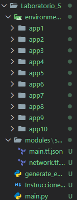
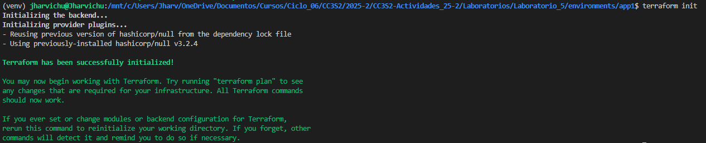
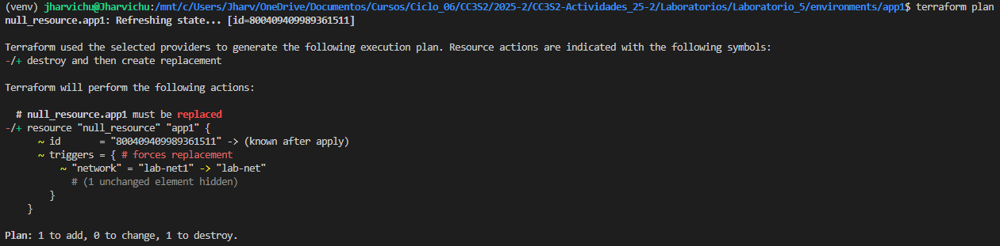

# Actividad: Escribiendo infraestructura como código en un entorno local con Terraform

####  Contexto

Imagina que gestionas docenas de entornos de desarrollo locales para distintos proyectos (app1, app2, ...). En lugar de crear y parchear manualmente cada carpeta, construirás un generador en Python que produce automáticamente:

* **`network.tf.json`** (variables y descripciones)
* **`main.tf.json`** (recursos que usan esas variables)

Después verás cómo Terraform identifica cambios, remedia desvíos manuales y permite migrar configuraciones legacy a código. Todo sin depender de proveedores en la nube, Docker o APIs externas.


#### Fase 0: Preparación 

1. **Ejecutamos**:

   ```bash
   python generate_envs.py
   cd environments/app1
   terraform init
   ```
2. **Verificamos**:

Observamos que se genero todos los proyectos creados con `generate_envs.py`

<p align="center">
  
</p>

Luego inicializamos la infraestructura generada en app1

<p align="center">
  
</p>

####  Fase 1: Expresando el cambio de infraestructura

* **Concepto**
Cuando cambian variables de configuración, Terraform los mapea a **triggers** que, a su vez, reconcilian el estado (variables ->triggers ->recursos).

* **Actividad**

  - Modifica en `modules/simulated_app/network.tf.json` el `default` de `"network"` a `"lab-net"`.
    ```json
    {
        "variable": [
            {
                "name": [
                    {
                        "type": "string",
                        "default": "hello-world",
                        "description": "Nombre del servidor local"
                    }
                ]
            },
            {
                "network": [
                    {
                        "type": "string",
                        "default": "lab-net",
                        "description": "Nombre de la red local"
                    }
                ]
            }
        ]
    }
    ```
  - Regenera `environments/app1` con `python generate_envs.py`
  - `terraform plan` observa que **solo** cambia el trigger en `null_resource`.
  
    Deberia cambiar, pero el script de python que genera estos entornos, no toma el valor default de la red, sino que asigna por medio de una iteracion los nombres de la red.
    ```python
    ENVS = [
    {"name": f"app{i}", "network": f"net{i}"} for i in range(1, 11)
    ]
    ```

    Pero al cambiarlo manualmente vemos que: 

    <p align="center">
      
    </p>

    Se observa que terraform nos informa del recurso que se remplazara.

* **Pregunta**

  * ¿Cómo interpreta Terraform el cambio de variable?
  
    Terraform no "ve" la variable de Python/TFVars directamente. Su proceso es:
    1. **Generación:** El script convierte la variable en un nuevo `main.tf.json`.
    2. **Comparación:** Terraform lee ese JSON y lo compara contra el `terraform.tfstate`.
    3. **Detección:** Nota que el valor en el JSON (`lab-net`) es distinto al del estado (`lab-net1`).

  * ¿Qué diferencia hay entre modificar el JSON vs. parchear directamente el recurso?
    
    * **Modificar JSON (IaC):** Es cambiar el **plano arquitectónico**. Es la forma correcta y persistente.
    * **Parchear recurso (Manual/Drift):** Es pintar la pared sin avisar al arquitecto. En el próximo `terraform apply`, Terraform detectará la "desviación" (Drift) y deshará tu cambio manual para restaurar lo que dice el código.

  * ¿Por qué Terraform no recrea todo el recurso, sino que aplica el cambio "in-place"?

    **Corrección:** Tu log muestra `-/+` (destroy and replacement), lo que significa que **SÍ** está destruyendo y recreando el recurso, **NO** es un cambio in-place.
    * **Razón:** Los `null_resource` son inmutables. Si cambia cualquier dato dentro de `triggers`, Terraform está obligado a destruir el recurso viejo y crear uno nuevo para asegurar que el script (`local-exec`) se ejecute otra vez.

  * ¿Qué pasa si editas directamente `main.tf.json` en lugar de la plantilla de variables?

    Rompes el flujo de automatización.
    * El archivo `.json` es un **artefacto de salida** (el resultado de la compilación), no el código fuente.
    * Si lo editas a mano, perderás esos cambios la próxima vez que ejecutes tu script de Python o pipeline, ya que el archivo será sobrescrito automáticamente.
