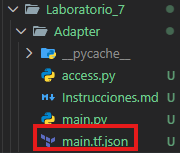
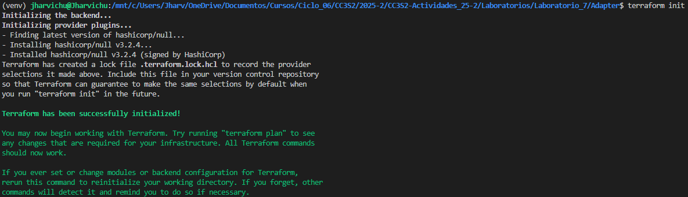
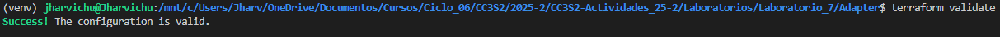
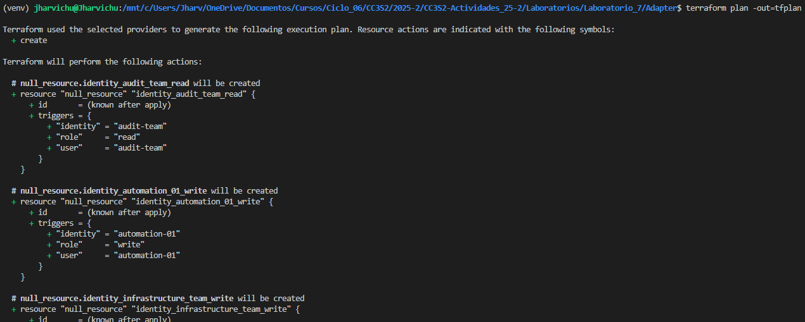
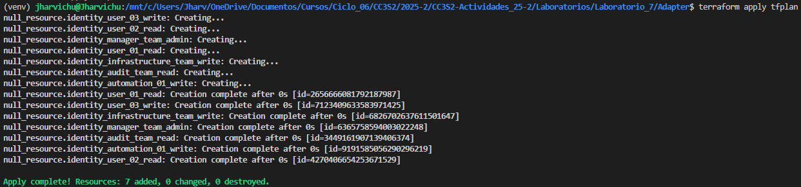

# Patron Facade

## Ejecucion

1. **Generar configuración**

   ```bash
   python main.py
   ```

   Produce `main.tf.json` con los recursos.

<p align="center">
  
</p>

2. **Inicializar Terraform**

   ```bash
   terraform init
   ```

   * Registra el proveedor `null`.

<p align="center">
  
</p>

3. **Validar configuración**

   ```bash
   terraform validate
   ```

   * Verifica sintaxis y coherencia.

<p align="center">
  
</p>

4. **Planificar**

   ```bash
   terraform plan -out=tfplan
   ```

   * Muestra los cambios previstos.
  
<p align="center">
  
</p>

5. **Aplicar**

   ```bash
   terraform apply tfplan
   ```

   * Ejecuta los `null_resource`, registrando los triggers en estado.

<p align="center">
  
</p>

6. **Revisar estado**

   ```bash
   terraform show
   ```

   * Consulta `terraform.tfstate`.

<p align="center">
  
</p>

#### **Ejercicios teóricos y prácticos**

>**Describe cómo garantizarías la validez del contrato `outputs()` en un proyecto con tres adaptadores distintos (por ejemplo, para GCP, AWS y fichero CSV). Indica qué pruebas unitarias escribirías para verificar que cada adaptador cumple su interfaz.**


Consideramos los siguientes adaptadores:
`GCPIdentityAdapter`, `AWSIdentityAdapter`, `CSVIdentityAdapter`
Todos estos adaptadores deberian tener el mismo contrato de salida (`Outputs()`), que produce tuplas, asi que definimos una interfaz base comom:

```python
from abc import ABC, abstractmethod

class IdentityAdapter(ABC):
    @abstractmethod
    def outputs(self):
   """Debe retornar una lista de tuplas (user, identity, role)."""
        pass
```
Hacemos que todos los adaptadores hereden esta interfaz

> **Analiza la complejidad temporal y espacial de `LocalIdentityAdapter` y de `LocalProjectUsers` en función del número de roles $R$ y usuarios $U$. ¿Cómo escalaría el sistema si duplicas el módulo de metadatos original?**

El codigo que tiene mas trabajo computacional es el siguiente:
```python
for permission, users in metadata.items():
   for user in users:
       self.local_users.append((user, user, permission))
 ```
Sea `R` el numero de roles.
Sea `U` el numero de usuarios.

**La complejidad temporal** es O(U) ya que recorre todos los usuarios una vez y la **La complejidad espacial** es O(U) ya que almacena una tupla por usuario.

Si se duplica el modulo de metadatos, entonces el numero de usuarios tambien se duplicaria, es decir, se escala linealmente, lo que es aceptable para sistemas pequenios o medianos.

> **Propón un adaptador para exportar los mismos metadatos a un archivo YAML en lugar de JSON para Terraform. Define la clase, los métodos y el contrato que debe respetar.**
   
```python
import yaml

class YAMLIdentityAdapter:
    """Adapter para exportar metadatos en formato YAML compatible con Terraform."""
    def __init__(self, metadata):
        self.data = [
            {"user": user, "identity": user, "role": permission}
            for permission, users in metadata.items()
            for user in users
        ]

    def outputs(self):
        """Devuelve los metadatos listos para exportar."""
        return self.data
```
El contrato que debe respetar son los `Outputs()` que retorna una tupla.

> **Crea un nuevo adaptador `AWSIdentityAdapter` que transforme el diccionario de `access.Infrastructure().resources` en una lista de tuplas `(user, arn, policy)` y genere un `main.tf.json` con recursos `aws_iam_user` y `aws_iam_policy_attachment` usando `null_resource` para simular la asignación de políticas.**

```python
import json

class AWSIdentityAdapter:
    def __init__(self, metadata):
        self.users = []
        for policy, users in metadata.items():
            for user in users:
                arn = f"arn:aws:iam::123456789012:user/{user}"
                self.users.append((user, arn, policy))

    def outputs(self):
        return self.users


class AWSProjectUsers:
    def __init__(self, users):
        self.users = users
        self.resources = self._build()

    def _build(self):
        aws_resources = {"resource": []}
        for (user, arn, policy) in self.users:
            user_res = {
                "aws_iam_user": {
                    user: {"name": user}
                }
            }
            attach_res = {
                "null_resource": {
                    f"attach_{user}_{policy}": {
                        "triggers": {
                            "user": user,
                            "arn": arn,
                            "policy": policy
                        }
                    }
                }
            }
            aws_resources["resource"].extend([user_res, attach_res])
        return aws_resources


if __name__ == "__main__":
    metadata = access.Infrastructure().resources
    users = AWSIdentityAdapter(metadata).outputs()
    with open("main.tf.json", "w") as f:
        json.dump(AWSProjectUsers(users).resources, f, indent=4)
```

> **Configura un pipeline sencillo (por ejemplo, con GitHub Actions) que automatice:**
>
>   * Ejecución de `python main.py` para regenerar `main.tf.json`.
>   * Comandos `terraform validate` y `terraform plan`.
>   * Reporte de errores en caso de validación o planificación fallida.

```yaml
name: Terraform Validation

on:
  push:
    branches: [ main ]
  pull_request:

jobs:
  terraform:
    runs-on: ubuntu-latest

    steps:
      - name: Checkout repository
        uses: actions/checkout@v4

      - name: Set up Python
        uses: actions/setup-python@v5
        with:
          python-version: '3.10'

      - name: Install dependencies
        run: pip install pyyaml

      - name: Generate Terraform config
        run: python main.py

      - name: Set up Terraform
        uses: hashicorp/setup-terraform@v3
        with:
          terraform_version: 1.8.5

      - name: Terraform Validate
        run: terraform validate

      - name: Terraform Plan
        run: terraform plan -no-color -out=tfplan

      - name: Upload Plan (on failure)
        if: failure()
        uses: actions/upload-artifact@v4
        with:
          name: terraform-error-log
          path: .
```