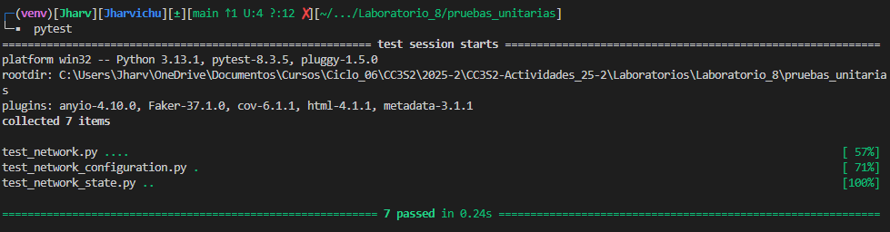
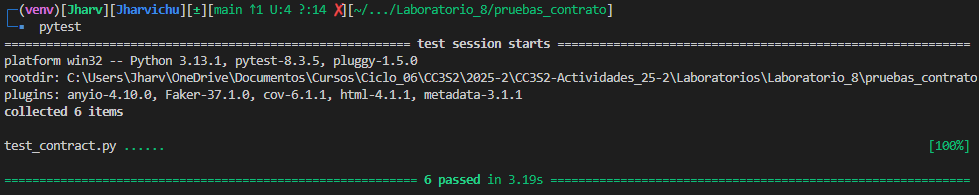
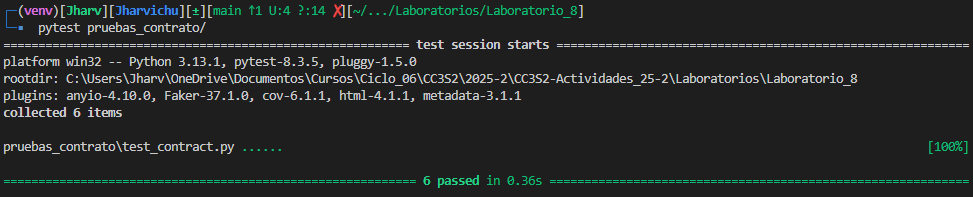

# Ejecucion del laboratorio 8

## Pruebas unitarias

Genera JSON de red y subredes locales y comprueba la estructura:

```bash
# Ejecutar tests unitarios
cd Laboratorios/Laboratorio_8/pruebas_unitarias
pytest
```

<p align="center">
  
</p>

## Pruebas de contrato

Valida el esquema JSON mínimo para módulos de red y servidor locales:

```bash
# Ejecutar tests de contrato
cd Laboratorios/Laboratorio_8/pruebas_contrato
pytest
```

<p align="center">
  
</p>

## Pruebas de Integracion

Simula `init`, `apply`, `destroy` y verifica el estado del recurso:

```bash
# Ejecutar tests de contrato
cd Laboratorios/Laboratorio_8/pruebas_integracion
pytest
```

<p align="center">
  
</p>

Desde la generación de config hasta la respuesta HTTP de un servicio simulado:

# Pruebas e2e

```bash
# Generar configuración de servicio local
python3 pruebas_e2e/main.py --name=my-service --out=pruebas_e2e

# Ejecutar tests E2E
pytest pruebas_e2e
```

<p align="center">
  
</p>